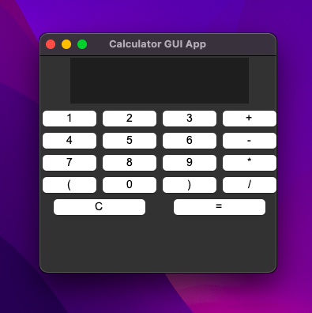

# Calculator GUI App
A simple, interactivr calculator built using Python's `tkinter`, currently supporting basic arithmetic operations and allows both GUI and keyboard numerical input.

-----------------------------------------------------------

## Features of This App

- GUI interface built with `tkinter`
- This app supports:
  - Addition `+`
  - Subtraction `-`
  - Multiplication `*`
  - Division `/`
  - Parentheses `()`
- Real-time keyboard input (numbers, operators, `c` for clear)
- Basic error handling for invalid expressions

-----------------------------------------------------------

## Screenshot of App



-----------------------------------------------------------

## Installation Instructions

To use this app, you should:
1. **Clone this repository**

```bash
git clone https://github.com/yourusername/calculator-gui-app.git
cd calculator-gui-app
```

2. **Run the app**

```bash
python calculator.py
```
-----------------------------------------------------------
## Built With

Python 3
Tkinter (standard Python GUI library)
